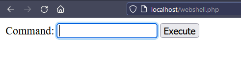
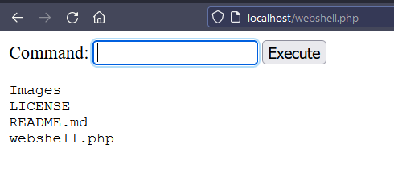
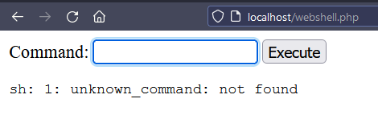

# Simple-PHP-Webshell
This is a simple PHP Webshell you can use when dealing with upload related exploits on PHP servers and your reverse shell one-liner rejects to work.

# Run and Test Locally
You can test the reverse shell locally by using the following command.

```bash
sudo php -S localhost:80
```

Note: You must have PHP installed on your machine. Most distros have the PHP package, so you can install it easily.

# Example Images

This is what the page looks like.

The input field has auto focus, so you don't need to use your mouse after every command. You can also ignore the button and execute the commands with the "return" key.



---

Example output when we run the command `ls`.



---

The Webshell is also capable of redirecting the error messages!


